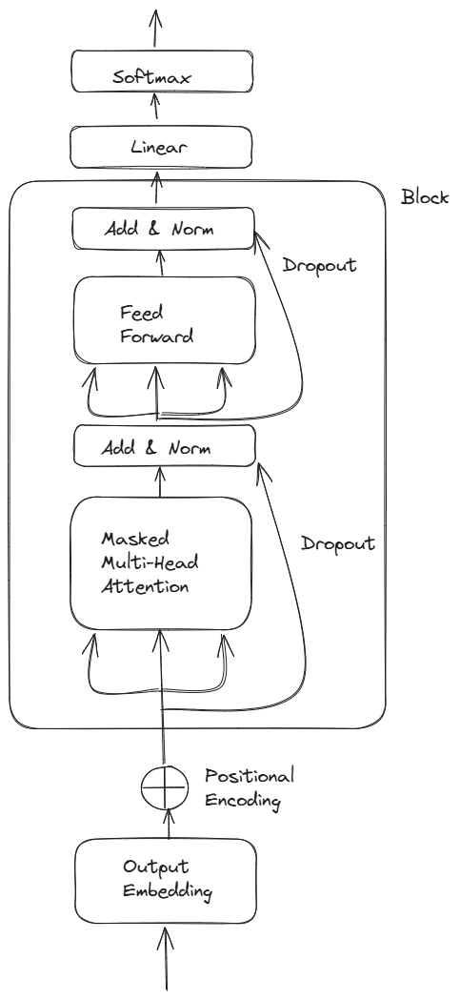
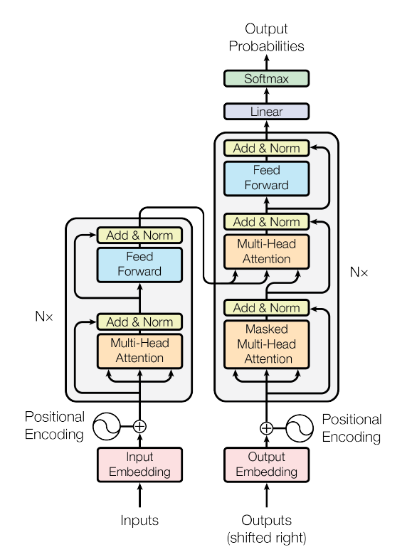
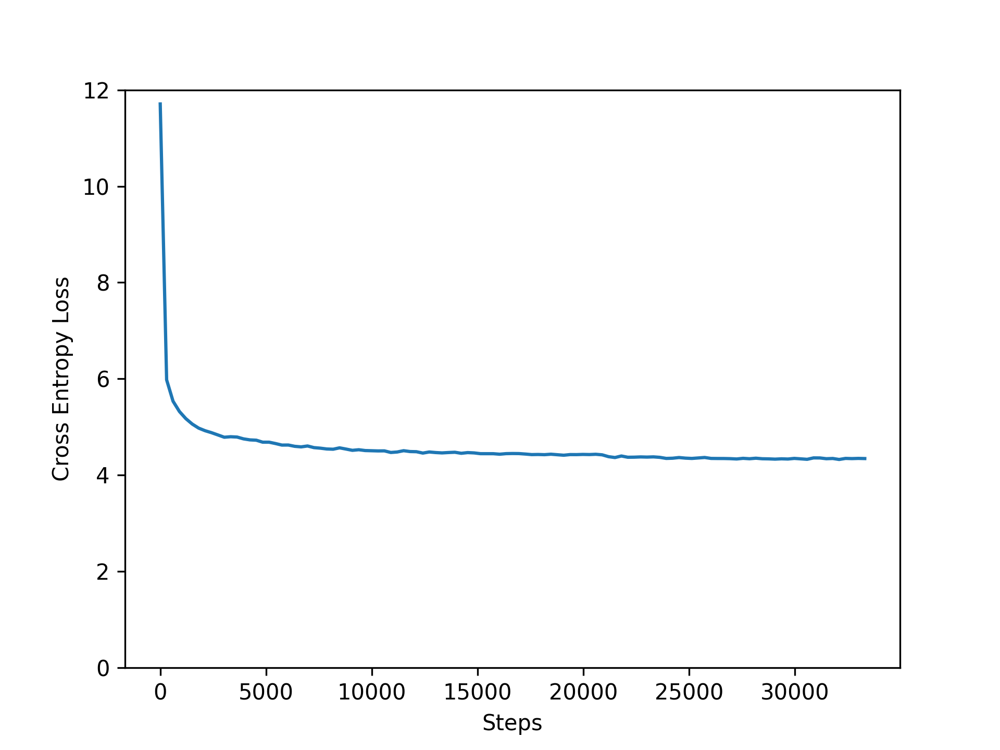

# Project
## Description
This is a mini version of GPT model, building generative transformer model based on tokenizer and neural network

The project is inspired by [nonoGPT](https://github.com/karpathy/nanoGPT/tree/master) by @karpathy

The latest version is train_v5.py

## Structure

```
nano-model
├── gpt2.py
├── input
├── model
├── plot
|  ├── GPT.png
|  └── myGPT.png
├── README.md
├── requirements.txt
├── results
├── train_v0.py
├── train_v1.py
├── train_v1_1.py
├── train_v2.py
├── train_v3.py
├── train_v4.py
├── train_v5.py
├── utility
|  ├── default_tokenizer.py
|  ├── gpt2_tokenizer.py
|  ├── tiktoken_tokenizer.py
|  ├── tokenizer.py
```

The structure of the model is like 

 

which is inspired by the transfomer model of GPT2



## Validation

The loss converges at about 4.33



The BLEU score is about 

## Commands
To start the virtual environment, run `venv\Scripts\activate` in Command Prompt in windows

To generate dependencies, run `pip freeze > requirements.txt`

To download dependencies, run `pip install -r requirements.txt`

To run the training script, run `python train_v5.py`

## Reference

1. Vaswani, Ashish; Shazeer, Noam; Parmar, Niki; Uszkoreit, Jakob; Jones, Llion; Gomez, Aidan N; Kaiser, Łukasz; Polosukhin, Illia (2017). Attention is All you Need. *Advances in Neural Information Processing Systems*.
2. Kaiming He; Xiangyu Zhang; Shaoqing Ren; Jian Sun (2014). Deep Residual Learning for Image Recognition. *2016 IEEE Conference on Computer Vision and Pattern Recognition (CVPR)*.